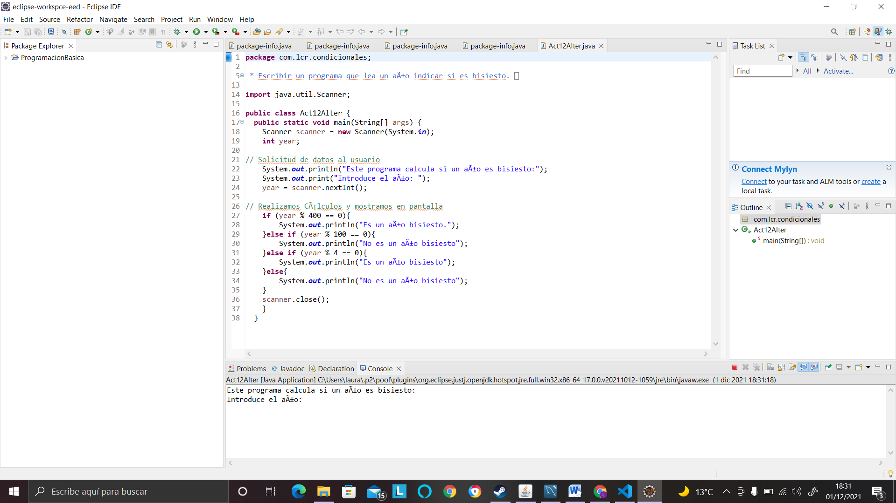
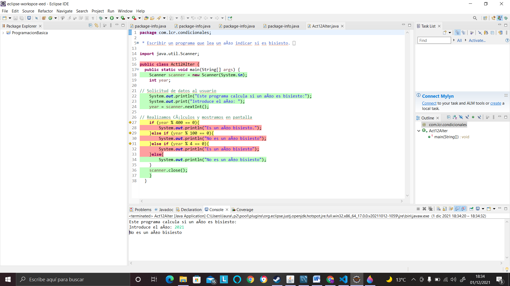
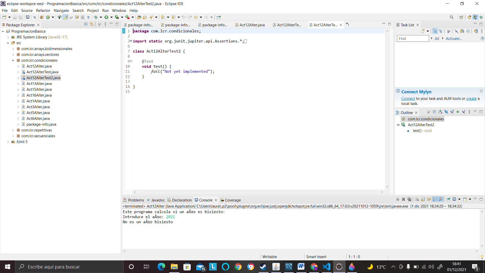
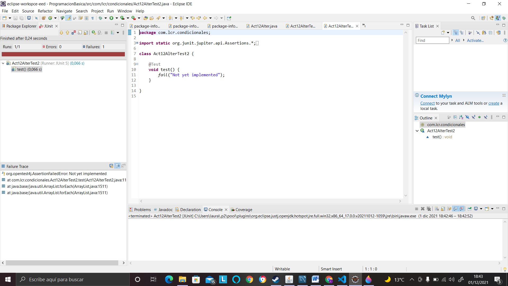

1. Ejecuta un programa con entrada/salida por consola.

1. Ejecuta el Eclemma sobre ese programa. 

1. Añade unos casos de prueba JUnit al programa

1. Depura el mismo programa

1. Añade comentarios JavaDoc a la clase y a los paquetes. Visualiza la vista documentación de alguno de ellos y localiza el menú para generar la documentación JavaDoc
No se hacerlo.....
